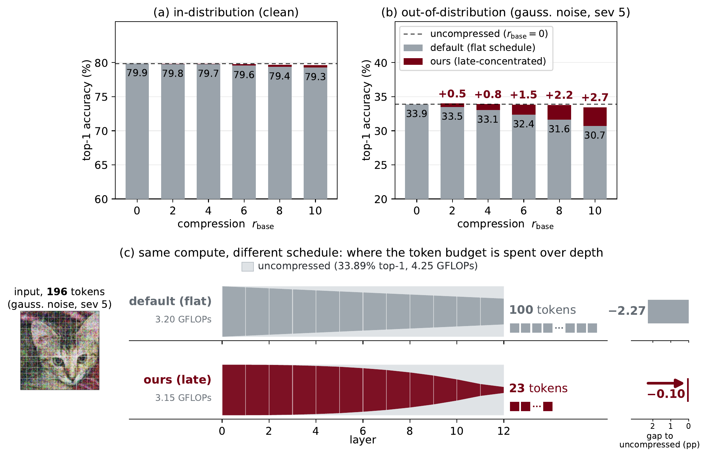

# Later Is Better: Token Reduction for ViTs Under Distribution Shift

[](https://arxiv.org/abs/2610.07758)
[](LICENSE)

Hyeongheon Cha, Hyungjun Yoon, Sung-Ju Lee (KAIST)

Paper: [Later Is Better: Token Reduction for ViTs Under Distribution Shift](https://arxiv.org/abs/2610.07758) (arXiv:2610.07758)

Training-free token reduction (ToMe, EViT, ATS, ATC, PiToMe) makes vision transformers cheaper but loses
accuracy under distribution shift. This repository holds the code behind the paper's claim that *where* the
removal budget is spent across layers is the lever: a one-parameter late-concentrated schedule recovers most
of that loss at matched compute, with no retraining and no per-input tuning.

<p align="center"></p>

*Token reduction increasingly sacrifices out-of-distribution accuracy; a late-concentrated schedule recovers it at
no extra compute. (a, b) DeiT-S top-1 against the per-layer removal rate `r_base` on clean and gaussian-noise
ImageNet-C. (c) Each ribbon's height is the tokens remaining: flat removes the same number at every layer, ours
follows the late-concentrated power law, ends with far fewer tokens, and lands closer to the uncompressed model.*

## Method

A reducer removes `r` tokens after each of the `L` transformer blocks. The flat schedule removes the same
`r_base` at every block. The late-concentrated schedule removes

    r(l) ∝ (l / L)^gamma,   l = 1..L,

so early blocks keep almost all tokens and the removal concentrates in the last blocks. Its budget is set so
that its GFLOPs are at or below the flat schedule's at the same `r_base`; `configs/iso_gflops_gamma_table.json`
lists, for every `(r_base, gamma)` and the two model widths, the per-block mean `total_r` that satisfies this
(`scripts/experiments/vitl_backbones/vitl_calib.py` recomputes it for a backbone of any depth). `gamma=2` is
the default; `gamma=0` is flat. The schedule is a list of per-block removal counts, so it applies unchanged to
any reducer that accepts one (`src/methods/schedules.py`), and it composes with test-time adaptation, which
runs on the reduced forward pass.

In a config the schedule is the `method` block:

```json
"method": {"name": "tome", "schedule": "late-concentrated", "total_r": 16, "schedule_gamma": 2.0}
```

`schedule` is `constant` (flat), `late-concentrated`, or `early-concentrated` (the mirror-image control);
`total_r` is the per-block mean budget; `schedule_gamma` the exponent.

## Results

ImageNet-C at severity 5, 15-corruption mean top-1 (%), DeiT-S with ToMe. The GFLOPs column is the default
`gamma=2` schedule's compute and its reduction against the unreduced model (39.40% at 4.25 GFLOPs). `flat` is
the constant-`r_base` baseline; the `gamma` columns are late minus flat at matched GFLOPs.

| r_base | GFLOPs (cut) | flat | gamma=0.5 | 1.0 | 1.5 | 2.0 | 2.5 | 3.0 |
|---:|---|---:|---:|---:|---:|---:|---:|---:|
| 2 | 3.97G (-7%) | 39.14 | +0.09 | +0.20 | +0.22 | +0.26 | +0.27 | +0.28 |
| 4 | 3.69G (-13%) | 38.83 | +0.23 | +0.38 | +0.50 | +0.54 | +0.61 | +0.60 |
| 6 | 3.34G (-21%) | 38.44 | +0.34 | +0.69 | +0.81 | +0.88 | +0.83 | +0.69 |
| 8 | 3.15G (-26%) | 37.99 | +0.57 | +0.90 | +1.11 | **+1.17** | +1.14 | +1.16 |
| 10 | 2.90G (-32%) | 37.41 | +0.67 | +1.17 | +1.28 | +1.25 | +1.15 | +0.92 |
| 12 | 2.67G (-37%) | 36.67 | +0.87 | +1.21 | +1.23 | +1.10 | +0.86 | +0.87 |

The tables below use the default `gamma=2` at the main operating point, `r_base=8` (about a quarter less
compute), with the same metric unless stated; `late` is calibrated to at most flat's GFLOPs.

**Five reducers** (DeiT-S / DeiT-B):

| Reducer | DeiT-S flat | late | delta | DeiT-B flat | late | delta |
|---|---:|---:|---:|---:|---:|---:|
| ToMe | 37.99 | 39.16 | +1.17 | 44.35 | 45.89 | +1.54 |
| EViT | 35.98 | 38.50 | +2.52 | 42.45 | 44.62 | +2.17 |
| ATS | 33.92 | 34.88 | +0.96 | 38.81 | 40.11 | +1.30 |
| ATC | 37.55 | 38.65 | +1.10 | 43.97 | 45.47 | +1.50 |
| PiToMe | 37.67 | 37.90 | +0.23 | 43.69 | 43.97 | +0.28 |

**Nine backbones** (ToMe; the 24-layer models at the same 24-25% compute cut):

| Backbone | flat | late | delta |
|---|---:|---:|---:|
| DeiT-S | 37.99 | 39.16 | +1.17 |
| DeiT-B | 44.35 | 45.89 | +1.54 |
| ViT-S | 38.05 | 39.46 | +1.41 |
| ViT-B | 53.39 | 54.96 | +1.57 |
| ViT-L | 58.82 | 60.62 | +1.80 |
| CLIP ViT-B | 43.68 | 45.07 | +1.39 |
| CLIP ViT-L | 57.29 | 58.41 | +1.12 |
| MAE ViT-B | 42.81 | 44.09 | +1.28 |
| MAE ViT-L | 52.97 | 54.19 | +1.22 |

**The gain grows with the shift** (DeiT-S with ToMe; severity 0 is clean ImageNet val):

| Severity | 0 (clean) | 1 | 2 | 3 | 4 | 5 |
|---|---:|---:|---:|---:|---:|---:|
| flat | 79.40 | 70.52 | 64.33 | 59.06 | 50.06 | 37.99 |
| late | 79.68 | 71.04 | 64.99 | 59.89 | 51.12 | 39.16 |
| delta | +0.28 | +0.52 | +0.66 | +0.83 | +1.06 | +1.17 |

**Under test-time adaptation** (ToMe, mean over 3 seeds; Tent, SAR and NEO are deterministic):

| Method | ViT-S flat | late | delta | ViT-B flat | late | delta |
|---|---:|---:|---:|---:|---:|---:|
| none | 38.05 | 39.46 | +1.41 | 53.39 | 54.96 | +1.57 |
| Tent | 48.47 | 52.04 | +3.57 | 54.49 | 55.72 | +1.23 |
| EATA | 52.65 | 53.66 | +1.00 | 59.09 | 60.11 | +1.01 |
| SAR | 51.52 | 51.96 | +0.43 | 59.71 | 61.07 | +1.35 |
| FOA | 42.42 | 42.81 | +0.39 | 59.80 | 60.41 | +0.61 |
| SPA | 51.22 | 52.98 | +1.76 | 63.53 | 64.81 | +1.28 |
| NEO | 40.97 | 41.97 | +1.00 | 56.81 | 58.16 | +1.34 |

## Running it

Two environments. ToMe, every schedule and test-time adaptation run in the main one; EViT, ATS, ATC and
PiToMe build against the timm 0.4.x vision transformer, which later releases reject, so they need their own.

| | main | reducers |
|---|---|---|
| python | 3.10 | 3.8 |
| torch / torchvision / timm | 2.7.1+cu126 / 0.22.1+cu126 / 0.9.10 | 1.8.2 / 0.9.2 / 0.4.12 |
| pins | `requirements-tome.txt` | `requirements-reducers.txt` |

```bash
pip install torch==2.7.1+cu126 torchvision==0.22.1+cu126 --extra-index-url https://download.pytorch.org/whl/cu126
pip install -r requirements-tome.txt
```

`cuml`, `cupy` and `datasets` are optional; without them ATC clusters with scikit-learn and the loaders are the
local ones, which is how every reported number was produced.

One run evaluates one model, one schedule and one dataset, and writes its metrics as JSON:

```bash
export DATA_ROOT=/path/to/datasets            # or one DATA_<KEY> per dataset, see below
python main.py --config configs/const_r8.json --metrics-json out.json          # flat, r_base=8
python main.py --config configs/const_r8.json --max-batches 2 --metrics-json smoke.json
```

| Option | Description |
|---|---|
| `--config` | JSON config (required) |
| `--metrics-json` | where to write the run's metrics |
| `--dump-preds` | also save the per-image correctness flags (`.npy`) |
| `--checkpoint` | load finetuned weights into the backbone |
| `--device`, `--seed` | override the config |
| `--max-batches` | stop early, for a smoke test |
| `--wandb true/false` | logging, off by default |

The ImageNet-C tables are run in three steps. `scripts/launch_table.py` writes one config per cell and a
jobs file for a target (`table1`, `table2`, `table3 --reducer <name>`, `table4`, `table6`, `table6_full`,
`nabirds`, `teaser`, `uncompressed`, `placement`, `shapes`, `shiftsuites`; `python scripts/launch_table.py -h`
describes each),
`scripts/experiments/sweep.py` runs a jobs file round-robin over the GPUs in `GPUS` (`PER_GPU` runs at a
time on each), and `scripts/summarize_table.py` aggregates the metrics into the table's rows:

```bash
python scripts/launch_table.py table1
python scripts/experiments/sweep.py output/table1 output/table1/table1_jobs.json
python scripts/summarize_table.py table1 output/table1
PY=/path/to/reducers/python python scripts/experiments/sweep.py output/table3 output/table3/table3_evit_jobs.json
```

`PY` names the interpreter `sweep.py` launches `main.py` with; the four non-ToMe reducers need the reducers'
one. Test-time adaptation (`table6`) is selected by `tta.method` in the config: `tent`, `eata`, `sar`,
`deyo`, `foa`, `spa`, `neo`.

The other blocks of numbers have their own drivers under `scripts/experiments/` (one directory each, see
`scripts/experiments/README.md`): the ViT-L, CLIP and MAE backbones, ImageNet-A/V2/R/Sketch, DomainNet-126,
the mechanism probes, the clean merge-path control, the per-image agreement data, the DiffRate
comparison, the four ImageNet-C corruptions outside the standard fifteen, and the cost of one adaptation step. `scripts/figures/` holds one script per figure; they read `output/` and write `output/figures/`.

## Data and inputs

Every dataset root is `${DATA_ROOT}/<leaf>` (default `./data/<leaf>`) unless the environment variable in the
first column points elsewhere.

| Variable | Default leaf | Contents and layout |
|---|---|---|
| `DATA_IN` | `imagenet` | ImageNet-1k, validation images under `val/<wnid>/` (also the source of the EATA and FOA warm-up statistics, computed at run time) |
| `DATA_IN_C` | `imagenet-c` | ImageNet-C, `<corruption>/<severity>/<wnid>/`, 224 px |
| `DATA_IN_R` | `imagenet-r` | ImageNet-R, `<wnid>/` (200 classes) |
| `DATA_IN_S` | `imagenet-sketch` | ImageNet-Sketch, `<wnid>/` |
| `DATA_IN_A` | `imagenet-a` | ImageNet-A, `<wnid>/` (200 classes) |
| `DATA_IN_V2` | `imagenet-v2` | ImageNet-V2 matched frequency, `<class index>/` |
| `DATA_IN_CBAR` | `imagenet-c-bar` | ImageNet-C-bar, `<corruption>/5/<wnid>/`, 224 px |
| `DATA_IN_3DCC` | `imagenet-3dcc` | ImageNet-3DCC, `<corruption>/5/<wnid>/`, 224 px |
| `DATA_NABIRDS_C` | `nabirds-c` | NaBirds test set with the 15 ImageNet-C corruptions, `<corruption>/<severity>/`, 224 px; each holds a full NaBirds tree (`images/`, `images.txt`, `image_class_labels.txt`, `train_test_split.txt`) |
| `DATA_DN126` | `domainnet126` | DomainNet-126, `targets/dn_<domain>/5/<class>/` for `real`, `sketch`, `clipart`, `painting` |

The ImageNet-R and ImageNet-A class subsets and the wnid order are in `src/imagenet_masks.json`.

Source models. The ImageNet backbones are timm's pretrained weights, downloaded on first use:
`deit_small_patch16_224`, `deit_base_patch16_224`, `vit_small_patch16_224`, `vit_base_patch16_224`,
`vit_large_patch16_224.augreg_in21k_ft_in1k`, `vit_base_patch16_clip_224.openai_ft_in1k`,
`vit_large_patch14_clip_224.openai_ft_in1k`. Everything else is a checkpoint listed in
`checkpoints/MANIFEST.json` with its sha256:

| Checkpoint | Used for | Origin |
|---|---|---|
| `mae_finetuned_vit_base.pth`, `mae_finetuned_vit_large.pth` | MAE rows | the official MAE release (fetched from its URL) |
| `<backbone>_domainnet126_real_timm.pth` (5 files) | DomainNet-126 | finetuned on the real domain with `scripts/experiments/natural_shift_domainnet/finetune_vit_imagefolder_norm.py` |
| `deit_small_patch16_224_nabirds.pth`, `vit_small_patch16_224_nabirds.pth` | NaBirds-C | finetuned on the NaBirds training split from the timm ImageNet weights |

```bash
bash checkpoints/fetch.sh     # downloads into checkpoints/ and verifies sha256
```

`CKPT_DIR` (default `checkpoints`) tells the MAE driver where to look; the NaBirds and DomainNet launchers
take the checkpoint path as an argument.

## Layout

```
main.py                        one config, one evaluation
configs/                       base configs the launchers derive their cells from; iso_gflops_gamma_table.json
src/
  methods/                     ToMe with the schedules (schedules.py, tome_extensions.py), method registry
  baselines/                   EViT, ATS, ATC, PiToMe
  tta_library/                 Tent, EATA, SAR, DeYO, FOA, SPA, NEO
  data.py, datasets_local.py   dataset loaders and roots
  config.py, modeling.py, eval.py, efficiency.py
scripts/
  launch_table.py              cells of the ImageNet-C tables and figures
  summarize_table.py           their rows from the metrics
  experiments/                 sweep.py, common.py, and one driver directory per further block of results
  figures/                     one script per figure
checkpoints/                   MANIFEST.json and fetch.sh; the weights themselves are not committed
requirements-tome.txt          pins of the main environment
requirements-reducers.txt      pins of the reducers' environment
```

Run outputs go to `output/`, which is not part of the repository.

## Citation

```bibtex
@article{cha2026later,
  title   = {Later Is Better: Token Reduction for ViTs Under Distribution Shift},
  author  = {Cha, Hyeongheon and Yoon, Hyungjun and Lee, Sung-Ju},
  journal = {arXiv preprint arXiv:2610.07758},
  year    = {2026}
}
```

## Acknowledgements and licences

The code written for this paper is released under the MIT licence (`LICENSE`). The files adapted from other
projects are not covered by it and keep their original licences, named at the top of each file:

| Component | File | Source | Licence |
|---|---|---|---|
| EViT (Liang et al., ICLR 2022) | `src/baselines/models/evit.py` | [youweiliang/evit](https://github.com/youweiliang/evit) | Apache 2.0 |
| ATS (Fayyaz et al., ECCV 2022) | `src/baselines/models/ats.py` | [adaptivetokensampling/ATS](https://github.com/adaptivetokensampling/ATS) | Apache 2.0 |
| ATC (Haurum et al., ECCV 2024) | `src/baselines/models/atc.py` | [JoakimHaurum/ATC](https://github.com/JoakimHaurum/ATC) | MIT |
| PiToMe (Tran et al., NeurIPS 2024) | `src/baselines/models/pitome.py` | [hchautran/PiToMe](https://github.com/hchautran/PiToMe) | CC BY-NC 4.0 |
| Tent | `src/tta_library/tent.py` | [DequanWang/tent](https://github.com/DequanWang/tent) | MIT |
| EATA | `src/tta_library/eata.py` | [mr-eggplant/EATA](https://github.com/mr-eggplant/EATA) | MIT |
| SAR | `src/tta_library/sar.py` | [mr-eggplant/SAR](https://github.com/mr-eggplant/SAR) | BSD 3-Clause |
| DeYO | `src/tta_library/deyo.py` | [Jhyun17/DeYO](https://github.com/Jhyun17/DeYO) | MIT |
| FOA | `src/tta_library/foa.py` | [mr-eggplant/FOA](https://github.com/mr-eggplant/FOA) | NTUitive, non-commercial |
| SPA | `src/tta_library/spa.py` | [mr-eggplant/SPA](https://github.com/mr-eggplant/SPA) | NTUitive, non-commercial |

NEO (`src/tta_library/neo.py`) is our own reimplementation (the [original repository](https://github.com/awesomealex1/NEO)
has no license file) and is covered by this repository's licence. PiToMe, FOA and SPA, and the ToMe matching code the clean merge-path control replays
(`scripts/experiments/cleanpath/run_cleanpath.py`), are for non-commercial use only. The code also builds on
**ToMe** (Bolya et al., ICLR 2023; CC BY-NC 4.0), installed from PyPI as `tome==0.1`, whose per-block `r`
list the schedules set; **DiffRate** (Chen et al., ICCV 2023), driven from its own clone (`DIFFRATE_ROOT`) by
`scripts/experiments/diffrate/`; and **timm** (Apache 2.0) for the backbones, **THOP** for the GFLOPs counts
and **cma** for FOA's optimizer.

